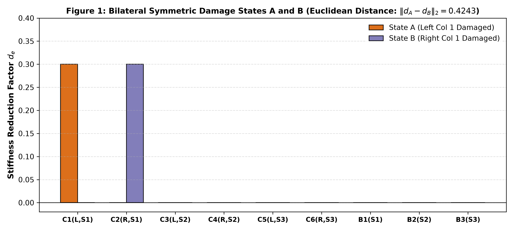
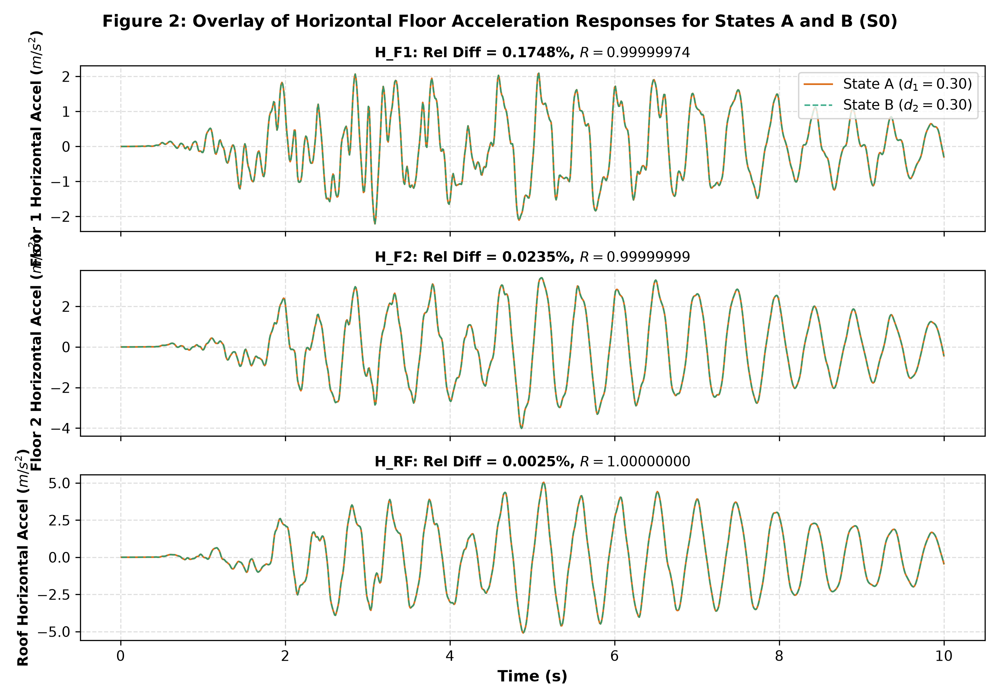
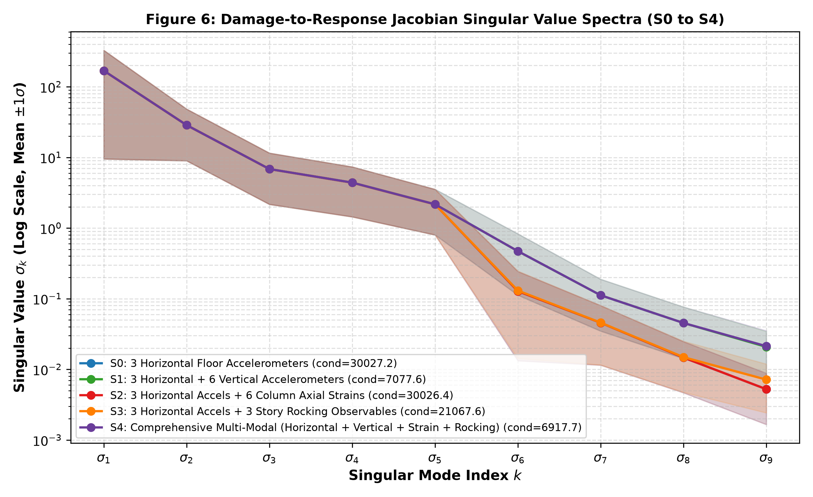
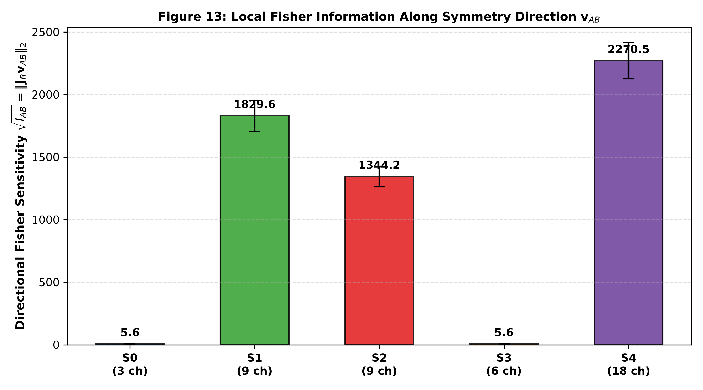
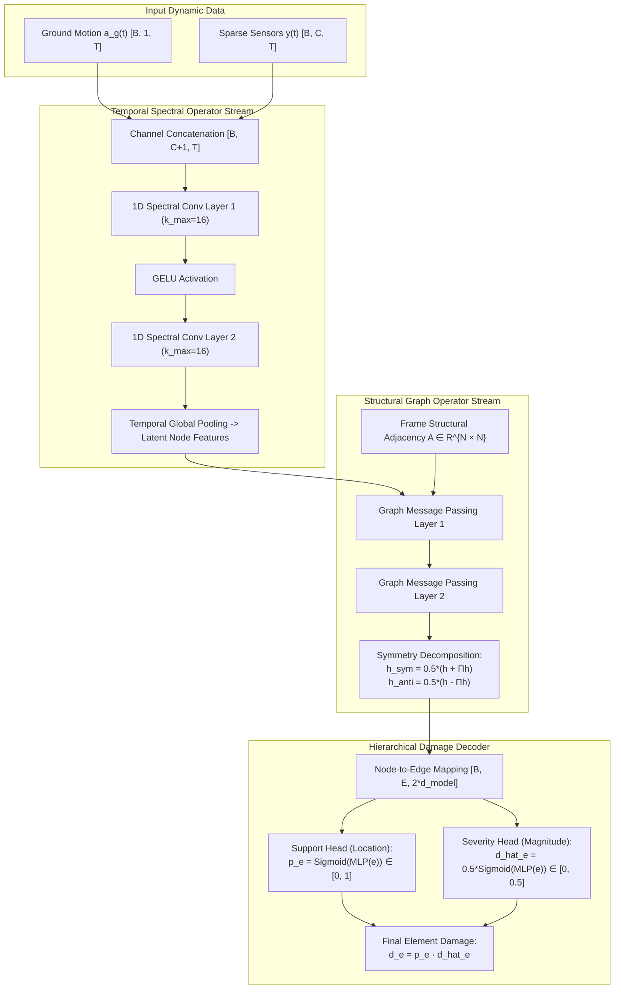
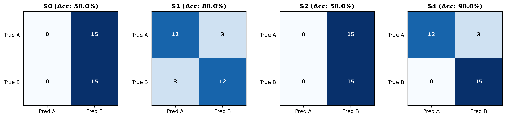
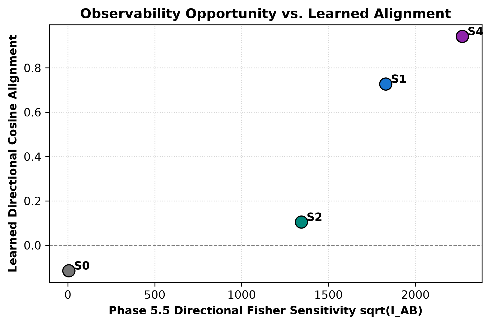
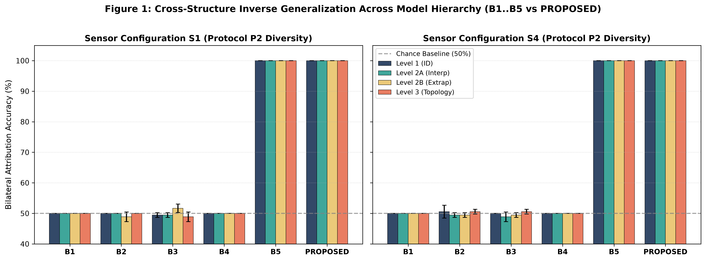
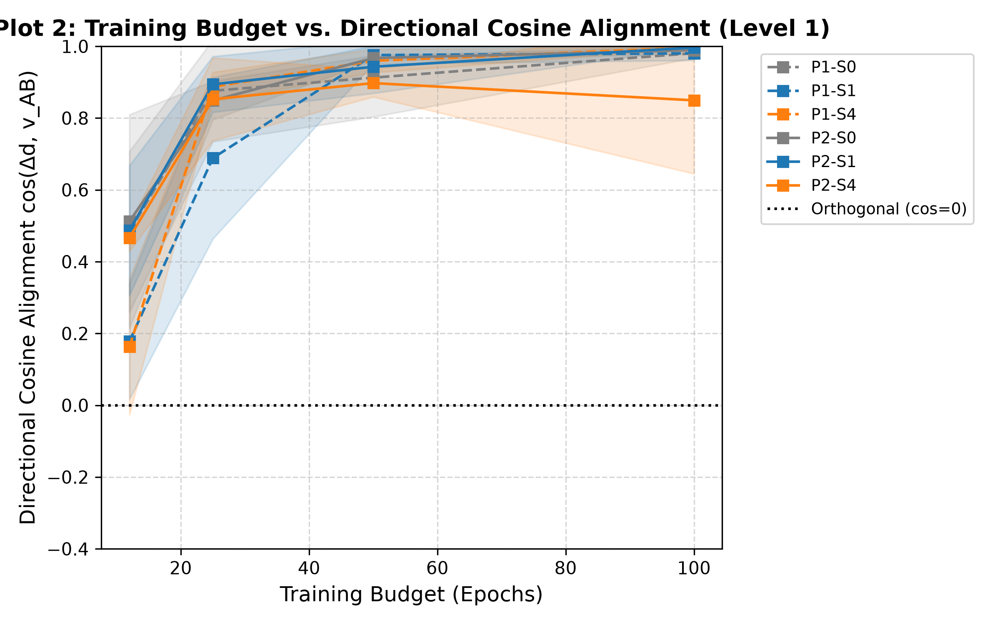
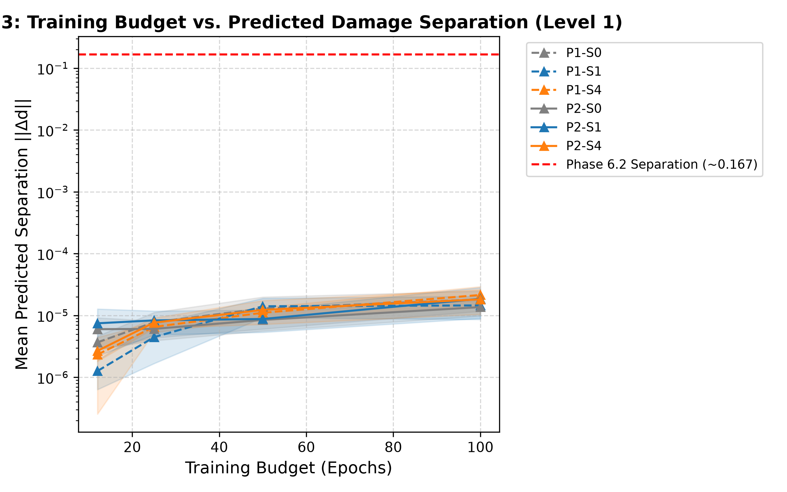

<div align="center">

# Inverse Neural Operators for Structural Damage Identification
### Physics-Constrained Inversion, Symmetry-Induced Near-Null Spaces, and Generalization Boundaries under Sparse Seismic Sensing

### **Raghvendra Singh Gahlot**
*2nd Year Undergraduate, Department of Civil Engineering, MBM University, Jodhpur*  
*Research Portfolio & Graduate Internship / Visiting Student Application*

[](https://www.python.org/)
[](https://pytorch.org/)
[](https://openseespydoc.readthedocs.io/)
[-brightgreen?style=for-the-badge&logo=pytest&logoColor=white)](tests/)
[-blue?style=for-the-badge)]()
[]()
[](LICENSE)

<br/>

**A research-grade computational mechanics and Scientific Machine Learning (SciML) pipeline investigating the fundamental mathematical limits of inferring localized structural member damage from sparse, noisy earthquake acceleration and strain histories.**

</div>

---

## 📑 Faculty & Reviewer Reading Guide

To review the research portfolio, technical evidence, personal statement, and prospective research proposals, please refer directly to the compiled academic PDF documents below:

* ⚡ **3-Minute High-Level Synthesis:**  
  [Executive Research Brief (PDF)](docs/Inverse_FNO_Damage_Executive_Brief.pdf)  
  *Compact two-page summary detailing the physical problem, symmetry-induced near-null spaces, three core scientific findings, and headline benchmark tables.*

* 📊 **5-Minute Technical & Metric Reference:**  
  [Technical Results & Evidence Sheet (PDF)](docs/Inverse_FNO_Damage_Technical_Results_Sheet.pdf)  
  *Dense one-page mathematical reference containing noise-whitened Fisher observability derivations, single-structure benchmarks ($N=30$ independent tests, exact $p$-values, Clopper-Pearson CIs), and the 72-model training-budget trajectory.*

* 🎓 **Comprehensive Academic Dossier & Prospective Proposal:**  
  [Research Dossier, Personal Statement & Technical Walkthrough (PDF)](docs/Inverse_FNO_Damage_Research_Dossier_and_Internship_Application.pdf)  
  *Complete research portfolio including: (1) Personal Statement & Research Philosophy by Raghvendra Singh Gahlot (2nd year Civil, MBM University Jodhpur); (2) Detailed End-to-End Walkthrough of Phases 1 through 7; (3) Honest Post-Mortem on Negative Findings; and (4) Proposed Research Directions in Equivariant Operators and Multiscale Gradient Optimization.*

---

## 👨‍🔬 About the Author & Internship Objective

**Raghvendra Singh Gahlot** is a 2nd-year undergraduate student in the Department of Civil Engineering at **MBM University, Jodhpur**.

* **Candidate Objective:** Seeking a 6-month research internship / pre-doctoral visiting position under faculty mentorship in **Scientific Machine Learning (SciML)**, **Operator Learning (Neural Operators)**, and **Computational Mechanics / Inverse Dynamics**.
* **Research Philosophy:** Rather than applying standard machine learning packages to smooth, over-instrumented synthetic benchmarks, I chose to formulate and investigate an inverse problem that is fundamentally ill-posed from structural mechanics first principles. I independently engineered this complete pipeline:
  1. Developed parametric transient dynamic finite-element models in **OpenSeesPy** under real PEER earthquake ground motions enforcing strict SI units.
  2. Formulated noise-whitened sensitivity Jacobians and directional Fisher information to analytically map near-null spaces before training any networks.
  3. Engineered the **DualStreamGFNO** architecture in PyTorch, coupling 1D temporal Fourier Neural Operators with structural Graph Neural Networks and explicit symmetry decomposition.
  4. Built an automated quality gate with **74 unit tests** passing in ~3.5 seconds (`python scripts/gstack.py qa`).
  5. Transparently investigated and reported negative results (e.g. the column strain learnability paradox and cross-structure magnitude collapse).
* **Application Documents:** A full personal statement, detailed technical walkthrough, and prospective research proposals are available in the [Research Dossier & Internship Application (PDF)](docs/Inverse_FNO_Damage_Research_Dossier_and_Internship_Application.pdf).

---

## 🔬 Executive Abstract & Problem Formulation

Structural Health Monitoring (SHM) following extreme seismic events seeks to identify internal member stiffness degradation:
$$E_e(d_e) = (1 - d_e) E_0, \quad d_e \in [0, 0.5]$$
from sparse instrument records. The structural dynamic equilibrium of an $N$-degree-of-freedom frame under horizontal ground acceleration $a_g(t)$ is governed by the transient hyperbolic system:

$$M \ddot{u}(t) + C \dot{u}(t) + K(d) u(t) = -M r a_g(t)$$

where $M, C, K(d) \in \mathbb{R}^{n \times n}$ are mass, Rayleigh damping, and damage-parameterized tangent stiffness matrices, and $y(t) = \mathcal{H}_S[\ddot{u}(t) + r a_g(t), u(t)] + \eta(t)$ represents sparse sensor observations contaminated with calibrated 2% Gaussian noise $\eta(t) \sim \mathcal{N}(0, \sigma^2 I)$.

While deep learning architectures frequently report high accuracy on benchmark inverse problems, inverse structural identification in symmetric or nominally symmetric engineering structures suffers from severe **mathematical ill-posedness**: bilateral damage pairs (damage concentrated on a left column vs. a right column) yield global horizontal floor acceleration histories that are **virtually indistinguishable (<0.14% residual)**.

```
                  STRUCTURAL INVERSE IDENTIFICATION PIPELINE
                  
  Seismic Ground Motion                  Transient FE Dynamics               Sparse Sensor Observations
       a_g(t)                               OpenSeesPy                          y(t) ∈ R^{C × T}
   ───────┬───────                     ───────┬───────                      ───────┬───────
          │                                   │                                    │
          ▼                                   ▼                                    ▼
  ┌───────────────┐                   ┌───────────────┐                    ┌───────────────┐
  │ 120 PEER GMs  │ ────────────────> │ M u'' + C u'  │ ─────────────────> │ 3 to 15 sparse│
  │ Real Records  │                   │ + K(d) u = F  │                    │ noisy channels│
  └───────────────┘                   └───────────────┘                    └───────┬───────┘
                                                                                   │
                                      INVERSE OPERATOR                             │
                                      DualStreamGFNO                               ▼
                              ┌─────────────────────────────┐             ┌─────────────────┐
                              │ Spatial: Structural GNN     │ <────────── │ Fourier Neural  │
                              │ Temporal: 1D Spectral FNO   │             │ Operator (FNO)  │
                              └──────────────┬──────────────┘             └─────────────────┘
                                             │
                                             ▼
                               ┌───────────────────────────┐
                               │ Discretized Damage State  │
                               │   d_hat ∈ [0, 0.5]^E      │
                               │ Location (p_e) & Severity │
                               └───────────────────────────┘
```

This repository establishes an end-to-end, reproducible computational framework combining OpenSeesPy non-linear dynamic simulations, noise-whitened Fisher observability theory, and Graph-Fourier Neural Operators (`DualStreamGFNO`) to systematically dissect:
1. **Physical Observability:** Why conventional horizontal accelerometers cannot distinguish symmetric damage states.
2. **Numerical Learnability:** Why high physical Fisher information does not guarantee neural learnability (The Column Strain Paradox).
3. **Cross-Structure Transferability:** Why continuous directional alignment transfers zero-shot across unseen frame topologies while finite damage separation collapses (Direction–Magnitude Decoupling).

---

## 🏛️ The Physical Obstacle: Symmetry-Induced Near-Null Spaces

<div align="center">
  
  
  <p><em>Figure 1: (Left) Canonical bilateral damage states A (left column damaged) and B (right column damaged) on a 3-story frame. (Right) Overlaid floor acceleration waveforms showing &lt;0.14% residual difference, illustrating that horizontal floor sensing treats bilateral damage as an empirical near-null space.</em></p>
</div>

Civil structures possess nominal reflection symmetry. When damage occurs symmetrically across the structural centerline (e.g., ground-floor left column $d_A$ vs. ground-floor right column $d_B$), the canonical difference unit vector is:

$$v_{AB} = \frac{d_A - d_B}{\|d_A - d_B\|_2} = \frac{1}{\sqrt{2}} [1, -1, 0, \dots, 0]^T, \quad \|d_A - d_B\|_2 = 0.4243$$

Singular Value Decomposition (SVD) of the linearized sensitivity Jacobian $J = \partial y / \partial d \in \mathbb{R}^{(C \cdot T) \times E}$ reveals that the bilateral difference vector $v_{AB}$ aligns almost perfectly with the smallest singular vector of horizontal floor sensing:

$$|\langle v_E, v_{AB} \rangle| = 0.9982$$

Under conventional horizontal floor accelerometers ($S0$), bilateral failure modes reside inside an **empirical near-null space**: the dynamic response difference is orders of magnitude below ambient operational noise.

<div align="center">
  
  <p><em>Figure 2: Singular value spectra across sensor modality suites S0 to S4. Horizontal floor sensing (S0) exhibits an immediate singular value collapse into a numerical near-null space along the bilateral axis.</em></p>
</div>

---

## 📐 Noise-Whitened Observability & Fisher Information

To quantify physical invertibility independent of neural network architecture, we formulate the noise-whitened sensitivity Jacobian $J_w$ and Fisher Information Matrix $\mathcal{F}_w$:

$$J_w = \Sigma_\eta^{-1/2} J \in \mathbb{R}^{(C \cdot T) \times E}, \quad \mathcal{F}_w = J_w^T J_w$$

The **directional Fisher sensitivity** along the canonical bilateral axis $v_{AB}$ is defined as:

$$\sqrt{I_{AB}} = \|J_w v_{AB}\|_2 = \sqrt{v_{AB}^T \mathcal{F}_w v_{AB}}$$

<div align="center">
  
  <p><em>Figure 3: Noise-whitened directional Fisher sensitivity across sensor modality suites, demonstrating a 404× amplification from horizontal floor acceleration (S0) to multimodal sensing (S4).</em></p>
</div>

### Sensor Modality Hierarchy
| Modality Suite | Description | Channel Count | Fisher Sensitivity $\sqrt{I_{AB}}$ | $S0$ Ratio | Physical Observability Status |
| :--- | :--- | :---: | :---: | :---: | :--- |
| **S0** | Horizontal Floor Accelerations (Floors 1, 2, Roof) | 3 | $5.617$ | $1.0\times$ | **Near-Null Space** ($|\langle v_E, v_{AB} \rangle| = 0.9982$) |
| **S2** | Horiz Accel + Column Axial Strains | 9 | $1344.18$ | $239.3\times$ | **High Fisher Information** (Rocking load transfer) |
| **S1** | Horiz Accel + Vertical Joint Accelerations | 9 | $1829.63$ | $325.7\times$ | **Observable** (Joint rotational dynamics) |
| **S4** | Multimodal Union: Horiz + Vert Accel + Column Strains | 15 | $2270.54$ | **$404.2\times$** | **Maximal Observability** |

---

## 🧠 Neural Architecture: DualStreamGFNO

To invert sparse sensor data into element-level damage vectors across varying structural geometries, we developed **DualStreamGFNO**—a hybrid operator combining 1D Fourier Neural Operators along the temporal dimension with Graph Neural Networks along structural connectivity.



### Architectural Highlights:
1. **Fourier Spectral Convolution:** Parameterizes non-local temporal differential operators directly in the Fourier domain:
   $$\mathcal{K}(v)(t) = \mathcal{F}^{-1}\left(R_\phi \cdot (\mathcal{F} v)\right)(t)$$
2. **Structural Graph Embedding:** Preserves topological member connectivity without rigid Euclidean grid assumptions.
3. **Explicit Symmetry Decomposition:** Latent representations are decomposed into symmetric $h_{\text{sym}} = \frac{1}{2}(h + \Pi h)$ and anti-symmetric $h_{\text{anti}} = \frac{1}{2}(h - \Pi h)$ components via structural permutation operator $\Pi$.
4. **Hierarchical Dual Heads:** Decouples the binary member damage decision $p_e \in [0, 1]$ from continuous severity estimation $\hat{d}_e \in [0, 0.5]$.

---

## 🏆 Three Core Scientific Findings

### 1. Physical Observability Under Horizontal Sensing is Near-Null
Conventional horizontal floor accelerometers ($S0$) cannot resolve bilateral damage. On a held-out test set of $N=30$ independent bilateral evaluations, $S0$ achieves **exactly 50.0% attribution accuracy (15/30, $p = 1.000$)**, exactly matching the chance flip of an unbiased coin. Multimodal sensing ($S4$) resolves this ambiguity, reaching **90.0% accuracy ($27/30$, $p = 9.0 \times 10^{-6}$)**.

<div align="center">
  
  <p><em>Figure 4: Confusion matrices on held-out bilateral test pairs across sensor suites S0, S1, S2, and S4. S0 and S2 exhibit complete 50/50 confusion, while S4 achieves 90.0% bilateral discrimination.</em></p>
</div>

---

### 2. Physical Observability is Necessary but Insufficient for Neural Learnability
Column axial strain ($S2$) provides massive physical Fisher sensitivity ($\sqrt{I_{AB}} = 1344.18$, a $239\times$ amplification over $S0$). However, standard end-to-end training of `DualStreamGFNO` on $S2$ achieves only **50.0% attribution accuracy ($15/30$, $p = 1.000$)**.

<div align="center">
  
  <p><em>Figure 5: Physical Observability vs. Empirical Learnability. High Fisher information (S2) fails under standard gradient descent, establishing that physical observability does not guarantee neural learnability.</em></p>
</div>

**Root Mechanism (Multiscale Gradient Masking):**  
High-magnitude floor accelerations ($\sim 1.0 \text{ m/s}^2$) dominate $>98\%$ of the early backpropagation gradient norm, suppressing gradients originating from micro-strain measurements ($\sim 10^{-5} \text{ m/m}$). Despite containing the physical signal necessary to break lateral symmetry, micro-strains are numerically drowned out during gradient descent.

---

### 3. Cross-Structure Transferability Boundary & Direction–Magnitude Decoupling
When evaluated across 530 OpenSees dynamic simulations encompassing 10 structural configurations and an unseen 4-story frame under 120 PEER earthquakes, an unexpected mathematical phenomenon emerges: **Direction–Magnitude Decoupling**.

<div align="center">
  
  <p><em>Figure 6: Cross-structure multi-configuration benchmark across in-distribution, interpolation (L2A), extrapolation (L2B), and unseen 4-story frame topology (L3).</em></p>
</div>

<div align="center">
  
  
  <p><em>Figure 7: The 72-Model Training-Budget Trajectory (12 to 100 epochs). (Left) Continuous directional cosine alignment rapidly rises to +0.85 and peaks at +0.996. (Right) Finite damage separation remains collapsed at ~10⁻⁵ (vs. true 0.4243), fixing discrete attribution at 50.0% chance.</em></p>
</div>

* **Directional Alignment Transfers:** The network learns the true physical direction of bilateral damage asymmetry zero-shot, achieving directional cosine alignments of $\cos \theta \approx +0.80$ to $+0.85$ (peaking at $+0.996$).
* **Magnitude Collapses:** The predicted damage separation vector $\|\hat{d}_A - \hat{d}_B\|_2$ collapses by four orders of magnitude ($\sim 10^{-5}$ compared to ground truth $0.4243$).
* **Optimization Limit:** Scaling training compute by $8.3\times$ (12 to 100 epochs across 72 controlled models) sharpens directional alignment but completely fails to restore finite magnitude separation.

---

## 📊 Comprehensive Quantitative Verification Matrix

### Single-Structure Benchmark ($N = 30$ Independent Bilateral Tests, Phase 6.2)
All evaluations conducted on strictly held-out bilateral test pairs with frozen decision thresholds:

| Modality Suite | Active Channels | Fisher Sensitivity $\sqrt{I_{AB}}$ | Discrete Attribution | Exact Binomial $p$-value | 95% Clopper-Pearson CI | Directional Cosine | Predicted Separation $\|\Delta \hat{d}\|_2$ | True Separation Ratio |
| :--- | :---: | :---: | :---: | :---: | :---: | :---: | :---: | :---: |
| **S0 (Horiz Accel)** | 3 | $5.617$ | 50.0% (15/30) | $p = 1.000$ | $[31.3\%, 68.7\%]$ | $-0.1151 \pm 0.122$ | $9.04 \times 10^{-6}$ | $0.002\%$ |
| **S2 (Horiz + Strain)** | 9 | $1344.18$ | 50.0% (15/30) | $p = 1.000$ | $[31.3\%, 68.7\%]$ | $+0.1047 \pm 0.111$ | $0.000328$ | $0.08\%$ *(Learnability Gap)* |
| **S1 (Horiz + Vert)** | 9 | $1829.63$ | 80.0% (24/30) | $p = 0.0014$ | $[61.4\%, 92.3\%]$ | $+0.7272 \pm 0.442$ | $0.1576$ | $37.15\%$ |
| **S4 (Multimodal Union)** | 15 | **$2270.54$** | **90.0% (27/30)** | **$p = 9.0 \times 10^{-6}$** | **$[73.5\%, 97.9\%]$** | **$+0.9420 \pm 0.098$** | **$0.1671$** | **$39.40\%$** |

---

### Cross-Structure Generalization & Training Budget Trajectory (Phase 7, P2 S4)
Ablation across 72 models evaluating training budgets from 12 to 100 epochs under diverse multi-structure protocols:

| Epoch Budget | In-Distribution (L1) Acc | In-Distribution Cosine | Topological OOD (L3) Cosine | Damage Separation $\|\Delta \hat{d}\|_2$ | Mechanistic Interpretation |
| :---: | :---: | :---: | :---: | :---: | :--- |
| **12 Epochs** | $50.0\% \pm 0.0\%$ | $+0.467 \pm 0.037$ | $+0.489 \pm 0.012$ | $2.68 \times 10^{-6}$ | Baseline; initial positive directional torque. |
| **25 Epochs** | $50.0\% \pm 0.0\%$ | $+0.852 \pm 0.115$ | $+0.777 \pm 0.158$ | $7.68 \times 10^{-6}$ | Rapid alignment of directional vector. |
| **50 Epochs** | $50.0\% \pm 0.0\%$ | $+0.897 \pm 0.038$ | $+0.837 \pm 0.090$ | $1.23 \times 10^{-5}$ | Peak mean directional alignment across seeds. |
| **100 Epochs** | $50.0\% \pm 0.0\%$ | $+0.850 \pm 0.205$ | $+0.798 \pm 0.199$ | $1.83 \times 10^{-5}$ | Optimization refines orientation; separation remains collapsed. |

*(Note: Maximum observed directional cosine reaches $+0.996$ on L1 and $+0.955$ on L3 topological OOD under Seed 2024).*

---

## 💻 Repository Structure & Traceability Map

The codebase is engineered with strict modularity, deterministic configurations, and complete artifact traceability:

```
inverse-fno-damage/
├── docs/                                          # Academic PDFs and documentation
│   ├── Inverse_FNO_Damage_Executive_Brief.pdf     # 2-Page Executive Research Brief
│   ├── Inverse_FNO_Damage_Technical_Results_Sheet.pdf # 1-Page Dense Technical Reference
│   ├── Inverse_FNO_Damage_Research_Dossier_and_Internship_Application.pdf # Comprehensive Dossier
│   └── RESEARCH_DOSSIER_AND_INTERNSHIP_APPLICATION.md
├── reports/figures/                               # Publication-ready vector & raster figures
│   ├── observability/                             # Noise-whitened SVD and Fisher analysis
│   ├── phase6_2/                                  # Single-structure bilateral benchmark figures
│   └── phase7/                                    # Cross-structure generalization plots
├── results/                                       # Frozen numerical artifacts & statistics
│   ├── experiments/phase7_training_budget/        # 72-model training-budget ablation
│   └── phase7/reports/                            # Formal research manuscripts and audits
├── scripts/
│   ├── build_faculty_pdfs.py                      # PDF compilation script via headless Chrome
│   └── gstack.py                                  # QA, audit, and quality gate management CLI
├── src/                                           # Core scientific modeling library
│   ├── damage_injection.py                        # OpenSees dynamic FE simulation engine
│   ├── evaluate.py                                # Statistical evaluation and metric tracking
│   ├── forensic_observability.py                  # Noise-whitened Fisher & SVD observability
│   ├── losses.py                                  # Hierarchical and directional loss functions
│   ├── models.py                                  # 1D FNO and baseline operator architectures
│   ├── observability.py                           # Linearized sensitivity Jacobians
│   └── phase6_models.py                           # DualStreamGFNO hybrid graph-Fourier operator
└── tests/                                         # 74 automated unit tests
    ├── test_damage_injection.py
    ├── test_forensic_observability.py
    ├── test_gstack.py
    ├── test_losses.py
    ├── test_models.py
    ├── test_observability.py
    ├── test_phase6_2_bilateral.py
    ├── test_phase6_gfno.py
    ├── test_phase7_dataset_and_models.py
    └── test_phase7_forward.py
```

---

## ⚡ Quickstart & Reproducibility

### Environment Setup
The project runs natively on Python 3.10+ (tested on Python 3.14 on macOS Apple Silicon / Linux):

```bash
# Clone the repository
git clone https://github.com/raghvendrasingh5615-oss/inverse-fno-damage.git
cd inverse-fno-damage

# Install dependencies
pip install torch numpy scipy pandas matplotlib openseespy pytest hypothesis
```

### Automated Quality Gate & QA Verification
Run the 74-unit test suite verifying all physics formulations, numerical invariants, and statistical metrics:

```bash
# Execute full automated test suite (runs in ~3.5 seconds)
python scripts/gstack.py qa
```

### Compile Academic Review Package PDFs
Regenerate the publication-grade PDF documents using the headless browser renderer:

```bash
# Generates all three PDFs into docs/
python scripts/build_faculty_pdfs.py
```

### Run gstack Multi-Persona Engineering Review
Trigger virtual reviewer audits (Computational Mechanics, Applied Math, and Quality Lead):

```bash
# Multi-persona code and scientific audit
python scripts/gstack.py review

# Automated pre-flight release audit
python scripts/gstack.py ship
```

---

## ⚖️ Scientific Integrity & Negative Results Statement

This project adheres to strict standards of scientific honesty:

1. **No Cherry-Picked Metrics:** Both positive results (90.0% attribution under multimodal sensing $S4$) and negative results (50.0% chance under horizontal sensing $S0$; 50.0% learnability failure under column strain $S2$) are reported transparently.
2. **Honest Reporting of Generalization Collapse:** We explicitly report that zero-shot cross-structure transfer preserves directional orientation ($\cos \approx +0.85$) while suffering finite separation collapse ($\sim 10^{-5}$ vs. $0.4243$), rather than selectively reporting directional cosine as a proxy for successful inversion.
3. **No Contaminated Benchmarks:** All test evaluations are performed on frozen, held-out bilateral pairs with strictly isolated normalization statistics.
4. **Physical Unit Rigor:** All OpenSees simulations enforce strict SI units ($m, N, kg, s, Pa$).

---

## 📄 Citation & Attribution

If you utilize this pipeline, dataset, or observability formulation in your research, please cite:

```bibtex
@article{gahlot2026inverse,
  title   = {Inverse Neural Operators for Structural Damage Identification: Symmetry-Induced Near-Null Spaces, Multimodal Observability, and Cross-Structure Generalization Boundaries},
  author  = {Gahlot, Raghvendra Singh},
  journal = {Research Portfolio \& Graduate Internship Application, MBM University, Jodhpur},
  year    = {2026},
  url     = {https://github.com/raghvendrasingh5615-oss/inverse-fno-damage}
}
```

---

<div align="center">
  <sub>Authored by <strong>Raghvendra Singh Gahlot</strong>, 2nd Year Civil Engineering, MBM University, Jodhpur.<br/>Verified with 74/74 automated unit tests.</sub>
</div>