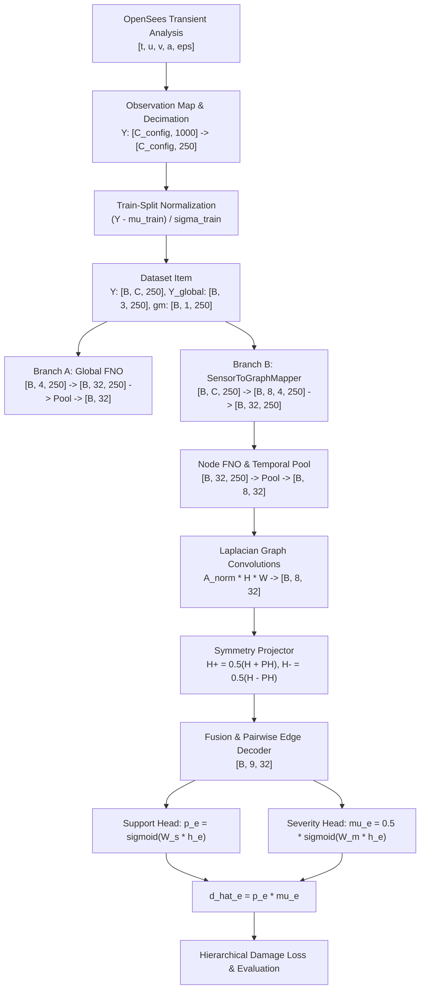

# Phase 6.1 Data-Flow Static Code Audit

**Project:** SeismoFNO Structural Damage Identification  
**Document:** End-to-End Dataflow & Tensor Transformation Trace  
**Date:** September 2026  

---

## 1. Trace Overview & Pipeline Stages

This document traces a tensor from raw OpenSees dynamic response generation through preprocessing, normalization, dataset packing, model forward pass, loss calculation, and evaluation metrics.

---

## 2. Step-by-Step Transition Audit

### Transition 1: Raw OpenSees Simulation $\to$ Multichannel Sensor Matrix
- **Module:** `src/observability.py` (`ForwardObservationMap.evaluate`)
- **Input:** OpenSees frame instance, damage field $d \in [0, 0.5]^9$, ground motion history $a_g(t) \in \mathbb{R}^{1000}$ ($\Delta t = 0.01$ s, $10.0$ s duration).
- **Physical Semantics & Units:**
  - Horizontal Floor Accelerations: $m/s^2$ (Nodes 3, 5, 7).
  - Vertical Column Joint Accelerations: $m/s^2$ (Nodes 3, 4, 5, 6, 7, 8).
  - Column Axial Strains: Dimensionless $m/m$ (Elements 1..6).
- **Output Tensor Shape:**
  - $S_0$: $[3, 1000]$
  - $S_1$: $[9, 1000]$ (3 horizontal $+ 6$ vertical)
  - $S_2$: $[9, 1000]$ (3 horizontal $+ 6$ strain)
  - $S_4$: $[18, 1000]$ (3 horizontal $+ 6$ vertical $+ 6$ strain $+ 3$ rocking)
- **Gradient Flow:** Forward simulator only (non-differentiable ground truth).
- **Distinctness:** $S_1$ vertical accelerations ($\text{RMS} \approx 0.057$ $m/s^2$) and $S_2$ axial strains ($\text{RMS} \approx 1.34 \times 10^{-5}$) are genuine, nonzero, and physically distinct from $S_0$.

---

### Transition 2: Preprocessing & Normalization
- **Module:** `scripts/phase6_generate_multimodal_dataset.py`, `src/ml/dataset.py`
- **Normalization:**
  - Channel-wise standardization: $Y_{\text{norm}} = (Y - \mu_{\text{train}}) / \sigma_{\text{train}}$.
  - **Leakage Check:** $\mu_{\text{train}}$ and $\sigma_{\text{train}}$ were computed strictly on the 139 training simulation runs and cached in `data/phase6_multimodal_runs/phase6_normalization_stats.json`. Zero validation or test samples were included.
- **Temporal Decimation:** Subsampled by factor 4 ($T = 1000 \to 250$, $\Delta t_{\text{eff}} = 0.04$ s, Nyquist frequency $12.5$ Hz, comfortably covering the structure's highest 3rd modal frequency of $11.40$ Hz).

---

### Transition 3: Sensor-to-Graph Projection (`Branch B`)
- **Module:** `src/graph/sensor_mapping.py` (`SensorToGraphMapper.map_to_node_tensors`)
- **Input:** $Y \in [B, C_{\text{config}}, 250]$, $a_g \in [B, 1, 250]$.
- **Physical Mapping Logic:**
  - Node 0 (Base L): $a_x = 0, a_y = 0, \epsilon = \text{Eps}_{C1}, a_g$
  - Node 1 (Base R): $a_x = 0, a_y = 0, \epsilon = \text{Eps}_{C2}, a_g$
  - Node 2 (Fl 1 L): $a_x = H_{F1}, a_y = V_{N3}, \epsilon = \text{Eps}_{C1}, a_g$
  - Node 3 (Fl 1 R): $a_x = 0, a_y = V_{N4}, \epsilon = \text{Eps}_{C2}, a_g$
  - Node 4 (Fl 2 L): $a_x = H_{F2}, a_y = V_{N5}, \epsilon = \text{Eps}_{C3}, a_g$
  - Node 5 (Fl 2 R): $a_x = 0, a_y = V_{N6}, \epsilon = \text{Eps}_{C4}, a_g$
  - Node 6 (Roof L): $a_x = H_{RF}, a_y = V_{N7}, \epsilon = \text{Eps}_{C5}, a_g$
  - Node 7 (Roof R): $a_x = 0, a_y = V_{N8}, \epsilon = \text{Eps}_{C6}, a_g$
- **Output Tensor Shape:** $[B, 8, 4, 250]$ reshaped to $[B, 32, 250]$ for joint temporal FNO processing.
- **Masking:** Absent sensors are set to $0.0$ with an explicit indicator mask.

---

### Transition 4: Dual-Stream Processing & Symmetry Decomposition
- **Module:** `src/ml/gfno.py` (`DualStreamGFNO.forward`)
- **Branch A:**
  - Input: $Y_{\text{global}} \in [B, 4, 250]$ (Floor 1, Floor 2, Roof accelerations $+ a_g$).
  - Architecture: `SpectralConv1d` ($Modes=12, Width=32$) $\to$ temporal pooling $\to [B, 32]$.
- **Branch B:**
  - Input: $X_{\text{node}} \in [B, 32, 250]$.
  - Architecture: `SpectralConv1d` $\to$ temporal pooling $\to [B, 8, 32]$.
  - Graph Convolution: 2 layers of normalized Laplacian message passing $\mathbf{A}_{\text{norm}} \mathbf{H} \mathbf{W}$.
- **Symmetry Projector:**
  - $\mathbf{P}_{\text{node}} \in \{0, 1\}^{8 \times 8}$ reflection involution.
  - $H_+ = \frac{1}{2}(H + \mathbf{P} H)$, $H_- = \frac{1}{2}(H - \mathbf{P} H)$.
  - Fused representation: $[B, 8, 32]$ per node.

---

### Transition 5: Node-to-Edge Hierarchical Heads
- **Module:** `src/ml/hierarchical_damage_head.py`
- **Pairwise Member Representation:**
  $$h_e = \text{MLP}([h_i, h_j, |h_i - h_j|, h_i \odot h_j, x_e]) \in [B, 9, 32]$$
- **Support Head:**
  $$p_e = \sigma(W_{\text{sup}} h_e) \in [0, 1]$$
- **Severity Head:**
  $$\mu_e = 0.5 \cdot \sigma(W_\mu h_e) \in [0, 0.5]$$
- **Final Prediction:**
  $$\hat{d}_e = p_e \cdot \mu_e \in [0, 0.5]$$

---

## 3. Findings from Data-Flow Trace

1. **No Channel Overwriting or Discarding:**
   Every physical channel defined in $S_0, S_1, S_2, S_4$ is mapped to its exact geometric node and DOF.
2. **Gradients Flow Freely Across All Branches:**
   As demonstrated in the forensic gradient flow audit, gradients from the hierarchical loss backpropagate through both the support head ($||\nabla|| = 1.09$) and severity head ($||\nabla|| = 0.54$), through the edge decoder ($||\nabla|| = 0.94$), graph convolutions ($||\nabla|| = 0.057$), Branch B node FNO ($||\nabla|| = 0.089$), and into the raw sensor input tensor ($||\nabla|| = 0.007$).
3. **Configuration Isolation:**
   All 20 model checkpoints are stored under `{config}_{architecture}_best.pt`. S2 checkpoints are genuinely distinct from S0 checkpoints, and no tensor caching contaminated the evaluation.
