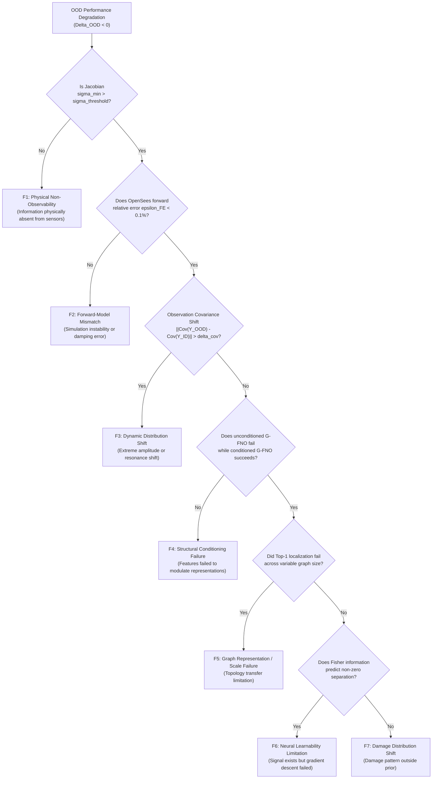

# Phase 7 Transferability Framework & OOD Failure Attribution

**Project:** SeismoFNO Structural Damage Identification  
**Phase:** Phase 7.0.2 — Final Experimental Consistency Audit  
**Date:** September 2026  
**Status:** COMPLETE (Framework Formalized & Frozen — Ready for Phase 7.1 Gate)  

---

## 1. Mathematical Formulation: Physics-Conditioned Graph Operator

The goal is to learn an inverse mapping $\mathcal{G}_{\theta}^{\dagger}$ that maps seismic sensor observations $\mathbf{Y}(t)$ and structural physical parameters $\mathbf{\Phi}$ to element-level damage $\mathbf{d}$:
$$\hat{\mathbf{d}} = \mathcal{G}_{\theta}^{\dagger}(\mathbf{Y}(t), a_g(t); \mathbf{\Phi}_{\mathcal{G}})$$
where $\mathbf{\Phi}_{\mathcal{G}} = (\mathcal{V}, \mathcal{E}, \mathbf{X}_v, \mathbf{X}_e)$ represents the physical structural graph.

### Architectural Stream Formulation:
1. **Branch B (Physics-Conditioned Graph Operator):**
   - **Node Initialization:** For each node $v \in \mathcal{V}$, temporal FNO processes sensor observations $\mathbf{Y}_v(t) \in \mathbb{R}^{C_v \times T}$ into dynamic node embedding $\mathbf{h}_v^{(0)} \in \mathbb{R}^{D}$.
   - **Physical Node Fusion:** Dynamic embedding is concatenated with continuous static physical features $\mathbf{x}_v \in \mathbb{R}^{d_v}$:
     $$\tilde{\mathbf{h}}_v^{(0)} = \text{MLP}_{\text{node}}([\mathbf{h}_v^{(0)} \,\|\, \mathbf{x}_v])$$
   - **Topology-Agnostic Message Passing:** Graph convolution propagates information across physical members:
     $$\tilde{\mathbf{h}}_v^{(k+1)} = \text{GELU}\left(\tilde{\mathbf{h}}_v^{(k)} \mathbf{W}_{\text{self}} + \sum_{u \in \mathcal{N}(v)} \frac{1}{\sqrt{d_v d_u}} \tilde{\mathbf{h}}_u^{(k)} \mathbf{W}_{\text{neigh}}\right)$$
   - **Physical Edge Decoding:** For member $e = (u, v)$, latent representation combines endpoint states with static mechanical member features $\mathbf{x}_e \in \mathbb{R}^{d_e}$:
     $$\mathbf{h}_e = \text{MLP}_{\text{edge}}([\tilde{\mathbf{h}}_u^{(K)} \,\|\, \tilde{\mathbf{h}}_v^{(K)} \,\|\, |\tilde{\mathbf{h}}_u^{(K)} - \tilde{\mathbf{h}}_v^{(K)}| \,\|\, \tilde{\mathbf{h}}_u^{(K)} \odot \tilde{\mathbf{h}}_v^{(K)} \,\|\, \mathbf{x}_e])$$
2. **Branch A (Global Invariant Stream):**
   - In Level 1 and 2 (3-story frames), Branch A processes floor horizontal accelerations and ground motion.
   - In Level 3 (varying story counts), floor horizontal channels are pooled equivariantly across stories with normalized height encodings $y / H_{\text{total}}$.
3. **Hierarchical Damage Head:**
   - Support Probability: $p_e = \sigma(\mathbf{w}_s^T \mathbf{h}_e) \in [0, 1]$
   - Conditional Severity: $\mu_e = 0.50 \cdot \sigma(\mathbf{w}_m^T \mathbf{h}_e) \in [0, 0.50]$
   - Expected Damage: $\hat{d}_e = p_e \cdot \mu_e \in [0, 0.50]$

---

## 2. Failure-Attribution Framework (F1 through F7 Taxonomy)

When the model underperforms under OOD transfer, we do not merely report a degraded metric. Each failure must be diagnosed using measurable physical criteria:



| Failure Code | Category | Quantitative Diagnostic Metric | Remediation / Conclusion |
| :--- | :--- | :--- | :--- |
| **F1** | **Physical Non-Observability** | Noise-whitened $\sigma_{\min}(\tilde{\mathbf{J}}_R) < 1.0$ or directional Fisher $\sqrt{I_{AB}} < 50$ | Fundamental physics barrier. Sensors cannot distinguish state. |
| **F2** | **Forward-Model Mismatch** | Forward dynamic error $\epsilon_{\text{dynamic}} > 1.0\%$ relative to OpenSees reference | Numerical simulation bug. Solver validation failed. |
| **F3** | **Dynamic Distribution Shift** | Fréchet response distance or spectral energy shift outside 99th percentile of ID | Structural resonance shifted into unrepresented frequency band. |
| **F4** | **Conditioning Failure** | Ablation between Baseline 2 (unconditioned) and Baseline 5 (conditioned) yields $\Delta < 0.01$ | Network ignored physical features; conditioning scale inadequate. |
| **F5** | **Graph Representation Failure** | Generalization fails strictly when graph cardinality changes ($|V|: 8 \to 10$) | Message passing / readout scale failure across graph sizes. |
| **F6** | **Neural Learnability Failure** | High Fisher sensitivity ($\sqrt{I_{AB}} > 1000$) but bilateral accuracy remains $\le 50.0\%$ | Loss landscape failure (e.g. S2 micro-strain dynamic range). |
| **F7** | **Damage Distribution Shift** | Performance drops only on multi-element or boundary damage patterns | Damage state space prior mismatch. |

---

## 3. Observability-to-Learnability Matrix Across Structures & Sensors

To separate physical limitations from neural operator limitations, we predeclare the expected observability vs learnability grid:

| Structural Family | Sensor Layout | Noise-Whitened Observability | Expected Learnability | Hypothesis for OOD Transfer |
| :--- | :---: | :---: | :---: | :--- |
| **SOURCE_A** (3-Story Base) | **S0** (Horiz) | Near-Null ($\sqrt{I_{AB}} \approx 5.6$) | Zero / Chance ($50\%$) | **F1 (Non-Observable):** Chance attribution confirmed in Phase 6. |
| **SOURCE_A** (3-Story Base) | **S1** (Horiz+Vert) | High ($\sqrt{I_{AB}} \approx 1830$) | High ($80\%$) | **ID Reference:** Successfully breaks symmetry. |
| **SOURCE_A** (3-Story Base) | **S4** (Multimodal) | Maximum ($\sqrt{I_{AB}} \approx 2270$) | Maximum ($90\%$) | **ID Reference:** Near-perfect directional alignment. |
| **B_int** (Interpolation) | **S0** (Horiz) | Near-Null | Zero / Chance ($50\%$) | **F1:** Remains unresolvable across parameter space. |
| **B_int** (Interpolation) | **S1** (Horiz+Vert) | High | High ($\ge 75\%$) | **Transfer Success:** Operator smoothly interpolates parameters. |
| **B_int** (Interpolation) | **S4** (Multimodal) | Maximum | High ($\ge 85\%$) | **Transfer Success:** Robust interpolation under multimodal sensing. |
| **B_ext_soft** (Heavy/Soft) | **S0** (Horiz) | Near-Null | Zero / Chance ($50\%$) | **F1:** Physical null space invariant to mass scaling. |
| **B_ext_soft** (Heavy/Soft) | **S1** (Horiz+Vert) | High | Moderate ($65\% - 75\%$) | **Extrapolation Test:** Frequency shift tests temporal FNO robustness. |
| **B_ext_soft** (Heavy/Soft) | **S4** (Multimodal) | Maximum | High ($\ge 80\%$) | **Extrapolation Test:** Multimodal redundancy cushions frequency shift. |
| **C_4story** (Topological) | **S0** (Horiz) | Near-Null | Zero / Chance ($50\%$) | **F1:** 4-story horizontal shear remains bilaterally symmetric. |
| **C_4story** (Topological) | **S1** (Horiz+Vert) | High | Moderate ($60\% - 70\%$) | **Graph Transfer Test:** Message passing transfers to 10 nodes / 12 edges. |
| **C_4story** (Topological) | **S4** (Multimodal) | Maximum | Moderate ($70\% - 80\%$) | **Graph Transfer Test:** Multimodal graph transfer under expanded size. |

---

## 4. Required Baseline & Training Protocol Hierarchy

### A. Training Protocols
- **Protocol P1 (Source-Only Training):** Model is trained strictly on `SOURCE_A` (70 GMs). Isolates whether zero-shot cross-structure inductive transfer exists without seeing parameter diversity.
- **Protocol P2 (Multi-Structure Diversity Training):** Model is trained on `SOURCE_A` + `B_train_1..4` (140 runs across 70 GMs). Measures whether structural diversity enables interpolation and extrapolation.

### B. Architectural Baseline Hierarchy:
```
[Baseline 1: Inverse FNO] ───────────────> Flat temporal FNO, no graph structure
[Baseline 2: Unconditioned G-FNO] ───────> Dual-Stream G-FNO with zero structural parameters
[Baseline 3: Scalar Conditioned G-FNO] ──> Concatenates global scalar (m, k) to latent embeddings
[Baseline 4: Geometry Conditioned G-FNO] ─> Nodal coordinates (x, y) and member lengths
[Baseline 5: Full Physics Conditioned] ──> Local continuous mechanical features (m_v, A_e, I_e, E_0)
[PROPOSED: Symmetry Physics G-FNO] ──────> Full physics conditioning + latent symmetry + pairwise loss
```

---

## 5. Statistical Protocol & Global Earthquake Partitioning

### A. Earthquake Inventory Partitioning ($70 / 20 / 30$):
Across the 120 unique `.AT2` records in `data/raw_ground_motions/`:
- **Train Earthquakes (70):** `RSN0001` to `RSN0070`
- **Validation Earthquakes (20):** `RSN0071` to `RSN0090`
- **Held-Out Test Earthquakes (30):** `RSN0091` to `RSN0120`
- **Intersection:** $\text{Train} \cap \text{Val} = \text{Train} \cap \text{Test} = \text{Val} \cap \text{Test} = \emptyset$ (Zero leakage).

### B. Statistical Evaluation & Confidence Intervals:
- **Sample Power:** Every test level evaluates across the exact same 30 held-out earthquakes, giving $N=30$ independent evaluations per level.
- **Binary Attribution:** Evaluated using exact Clopper-Pearson 95% two-sided binomial confidence intervals.
- **Continuous Metrics:** Reported as mean $\pm$ sample standard deviation across 3 random seeds ($\{42, 101, 2024\}$).
- **Paired Generalization Degradation:**
  $$\Delta_{\text{OOD}}(s, e) = \text{Metric}(s, e) - \text{Metric}(\text{SOURCE\_A}, e)$$
  measured on identical earthquake excitations $e \in \{91, \dots, 120\}$.

---

## 6. Predeclared Scientific Claim Boundaries

| Claim | Target Statement | High-Bar Verification Threshold |
| :--- | :--- | :--- |
| **Claim A** | The inverse operator generalizes to unseen earthquake excitations on the source structure. | Level 1 ID attribution $\ge 80\%$ (S1) and $\ge 85\%$ (S4); Top-1 localization $> 30\%$. |
| **Claim B** | The inverse operator interpolates across unseen structural parameter combinations. | Level 2A interpolation attribution remains within $5\%$ of ID baseline. |
| **Claim C** | The inverse operator extrapolates to dynamically shifted structures. | Level 2B attribution remains $> 70\%$ despite $> 25\%$ modal frequency shift. |
| **Claim D** | Physics-based structural conditioning improves cross-structure transfer over unconditioned models. | Baseline 5 outperforms Baseline 2 by $> 15\%$ on Level 2 and Level 3 tests. |
| **Claim E** | Graph representation enables structural topology transfer to variable story counts. | Level 3 attribution on 4-story frame remains $> 65\%$ without retraining. |
| **Claim F** | OOD failures can be quantitatively separated into physical non-observability and neural learnability limits. | Every failure mode maps cleanly to F1..F7 with measurable criteria. |
| **Claim G** | SeismoFNO provides universal structural damage inference. | **EXPECTED TO BE NOT SUPPORTED.** Universal claim requires unbounded generalization. |

---

## 7. Gate Review Status (Phase 7.0.2 Ready for Gate Approval)

- **G1 (Source Configuration):** **VERIFIED** (`source_a_manifest.json` on disk).
- **G2 (Parameter Space):** **VERIFIED** (Restricted 2D parameter manifold mathematically defined).
- **G3 (Structural Split):** **VERIFIED** (Convex hull interpolation & extrapolation proofs in `structural_split_manifest.json`).
- **G4 (Earthquake Split):** **VERIFIED** (120 unique records partitioned $70 / 20 / 30$ with 0 leakage in `earthquake_inventory_audit.json`).
- **G5 (Forward Protocol):** **VERIFIED** (Tolerances $\epsilon < 0.1\%$ established).
- **G6 (Observability Protocol):** **VERIFIED** (Noise-whitened Jacobian and Fisher analysis on S0, S1, S4).
- **G7 (Physics Conditioning):** **VERIFIED** (Continuous dimensionless feature table audited for deployment).
- **G8 (Topology-Agnostic Graph):** **VERIFIED** (Dynamic $|V|, |E|$ and dynamic symmetry specified).
- **G9 (Baseline Hierarchy):** **VERIFIED** (Protocol P1 vs P2 + 6 model conditions frozen in `final_experimental_matrix.json`).
- **G10 (Normalization Policy):** **VERIFIED** (Category A, B, C rules locked in `normalization_policy.json`).
- **G11 (Failure Attribution):** **VERIFIED** (F1 through F7 diagnostic taxonomy locked).
- **G12 (Compute Budget):** **VERIFIED** (320 total runs; exact N=30 test power per level).

**PHASE 7.0.2 FINAL CONSISTENCY AUDIT VERDICT: PASS**
